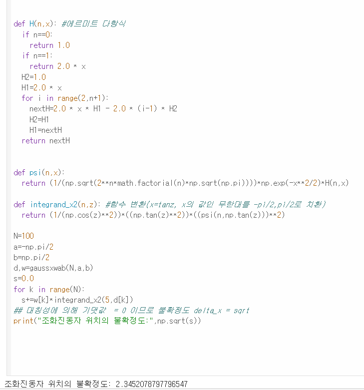
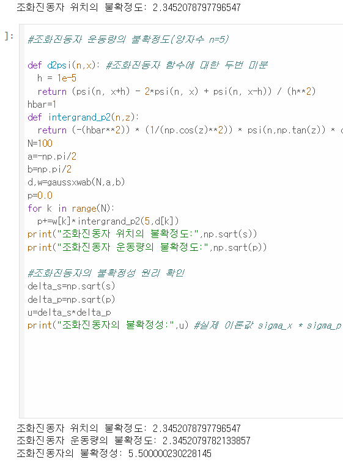

# Computational-Physics-Newman

마크 뉴먼(Mark Newman)의 Computational Physics

## Tech Stack & Environment
- **Language:** Python 3.x
- **Libraries:** Numpy, Matplotlib, Scipy
- **Environment:** Google Colab

## Numerical Integration ##
- **조화진동자 위치 및 운동량의 불확정도 계산:** 가우스 구적법을 적용하여 양자 조화진동자의 파동함수 및 위치/운동량 불확정도 계산 그리고 불확정성 원리 구현

- **Other:** 가우스 구적법을 이용한 디바이(Debye) 열용량 모델 및 2D회절 패턴 모델 구현

## Linear and Nonlinear Equations ##
- **비대칭 양자우물 에너지 준위 수치해석:** 포텐셜의 비대칭성을 해석적으로 먼저 단순화하여  행렬 구성 및 고유값 연산 속도 대폭 단축.
- **라그랑주 점 수치해석** 

## Fourier Transformation ##
- **DFT vs FFT 성능 분석:** 이산 푸리에 변환(DFT)의 시간 복잡도 한계를 직접 확인한 후,
  'scipy.fft' 라이브러리를 도입하여 고속 푸리에 변환(FFT)으로 최적화.
- ** 데이터의 주파수 스펙트럼 분석

## Ordinary Diffrential Equation ##
- **상미분방정식(ODE) 수치 해석:** 오일러(Euler) 및 룽게-쿠타(Runge-Kutta, RK4) 알고리즘을 구현하여 비선형 진동자 및 동영학 시스템의 시간 변화 시뮬레이션

## Future Implementations ##
- Simulation of 1D Quantum Wavepacket Scattering at step & Barrier Potentials(Time-dependent Evolution)
